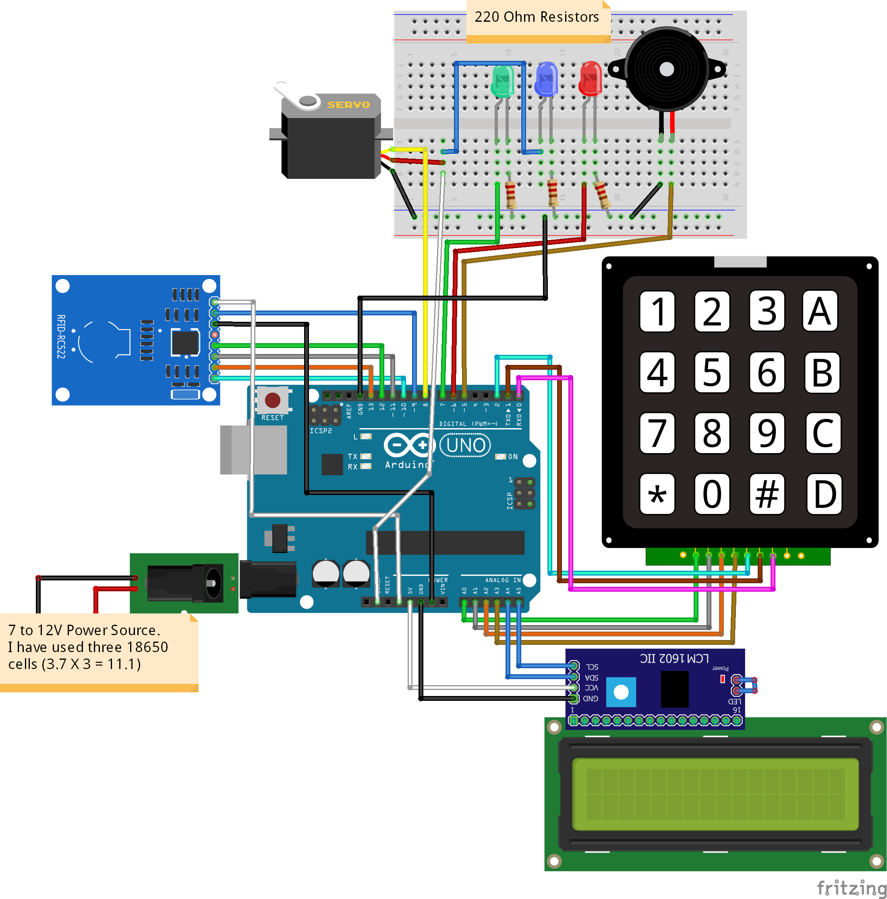

# RFID and Keypad Door Lock System

## Overview

This project implements a door lock system using RFID cards and a keypad. The system is built on the Arduino platform and uses an RFID reader, a servo motor, a keypad, and an LCD display to provide secure access control.

## Components Used

- Arduino Board
- MFRC522 RFID Reader
- Servo Motor
- 4x4 Keypad
- 16x2 LCD Display
- Buzzer
- LEDs
- Relay

## Wiring Instructions

1. Connect the RFID reader to the specified pins (SS_PIN, RST_PIN).
2. Connect the servo motor to pin 10.
3. Connect LEDs (LED_G, LED_R), buzzer (BUZZER), and relay (RELAY) to their respective pins.
4. Connect the keypad to the specified row and column pins.
5. Connect the LCD display to the I2C interface (SDA, SCL).

## Wiring Connections:
### RFID Reader (MFRC522):

SS_PIN (Slave Select): Connect to Arduino digital pin 10.
RST_PIN (Reset): Connect to Arduino digital pin 0.
SDA, SCK, MOSI, MISO: Connect to Arduino SPI pins (11, 13, 12, 10, respectively).
VCC: Connect to Arduino 3.3V.
GND: Connect to Arduino GND.
### Servo Motor:

Signal: Connect to Arduino digital pin 10.
VCC: Connect to Arduino 5V.
GND: Connect to Arduino GND.
### LEDs and Buzzer:

Green LED (LED_G): Connect to Arduino analog pin A1.
Red LED (LED_R): Connect to Arduino analog pin A2.
Buzzer: Connect to Arduino analog pin A0.
### Relay:

Connect the relay control pin to Arduino digital pin A3.
Connect the relay common (COM) and normally open (NO) contacts to the door locking mechanism.
### 4x4 Keypad:

Connect the rows (R1-R4) to Arduino digital pins (6, 7, 8, 9).
Connect the columns (C1-C4) to Arduino digital pins (5, 4, 3, 2).
### 16x2 LCD Display (I2C):

Connect SDA to Arduino analog pin A4.
Connect SCL to Arduino analog pin A5.
Connect VCC to Arduino 5V.
Connect GND to Arduino GND.

Power Supply:
Ensure the Arduino board is powered via USB or an external 5V power supply.
Provide a separate power supply (5V) for the servo motor.
Additional Notes:
Double-check the polarity of LEDs, buzzer, and power connections to prevent damage.
Make sure all ground (GND) connections are common.
Confirm the correct UID of authorized RFID cards in the Arduino code.
Adjust servo angles (Lock and Unlock) in the code based on your servo's specifications. 

## Installation and Setup

1. Download and install the necessary libraries:
   - MFRC522 library
   - LiquidCrystal_I2C library
   - Servo library
   - Keypad library

2. Upload the provided Arduino code to your Arduino board.

3. Power up the system and ensure all connections are correct.

## Usage

1. When the system starts, it initializes and waits for an RFID card to be scanned.

2. Authorized RFID cards (specified in the code) will grant access and display "ACCESS GRANTED" on the LCD.

3. Unauthorized cards will trigger the red LED and display "Access denied" on the LCD.

4. A keypad is provided to enter a password. Change the password in the code as needed.

5. Entering the correct password will unlock the system, and the green LED will light up.

6. Press 'C' on the keypad to close the door, and the system will return to the initial state.

## Notes

- Ensure the correct UID of authorized RFID cards is specified in the code.
- Change the password in the code to your desired combination.
- Adjust servo angles (Lock and Unlock) according to your setup.

Happy coding!
